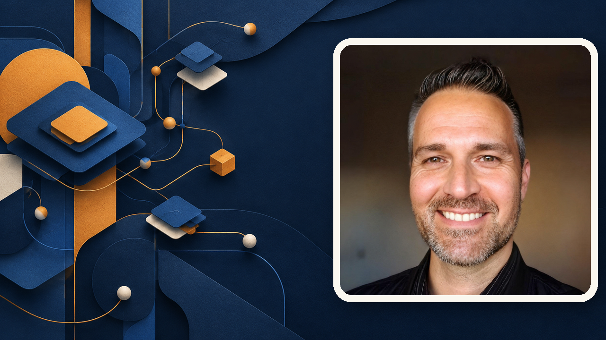

# AI Skills Library

Reusable skills for Codex, Claude Code, and other coding agents.

## Table of Contents

1. [Getting Started](#getting-started)
2. [Details](#details)
3. [Resources](#resources)
4. [Credits](#credits)

## Getting Started

### 1. Get the skills

From your project directory, run:

```sh
npx skills@latest add SamuelAsherRivello/ai-skills-library --copy
```

Choose the skills you want and the agents to install them for, including Codex and Claude Code. Project-local installation is the recommended default. `--copy` installs ordinary files you can edit.

To install globally instead, add `--global`:

```sh
npx skills@latest add SamuelAsherRivello/ai-skills-library --copy --global
```

### 2. Update the skills

For project-local installations:

```sh
npx skills update --project
```

For global installations:

```sh
npx skills update --global
```

For the manual copy workflow between this repository and Codex user/project skills, see [AI Skills Library Commands](documentation/ai-skills-commands-readme.md).

## Details

### Skills

| # | Name | Link | Comment |
|---:|---|---|---|
| 1 | Create | [Catalog](.agents/skills/ai-skills-create/README.md) | Create React apps, browser games, repositories, and releases. |
| 2 | AI Skills Library | [Catalog](.agents/skills/ai-skills-library/README.md) | Manage library, global, and project skill copies. |
| 3 | Docker Sandbox | [Catalog](.agents/skills/docker-sandbox/README.md) | Configure and inspect isolated Docker Sandbox environments. |
| 4 | OpenSpec | [Catalog](.agents/skills/openspec/README.md) | Explore, plan, implement, and finalize changes. |
| 5 | Tiled AI | [Catalog](.agents/skills/tiled-editor/README.md) | Set up the Tiled AI MCP and author Tiled maps and tilesets. |
| 6 | Triage | [Catalog](.agents/skills/triage/README.md) | Assess architecture health, standardize codebases, and plan refactors. |
| 7 | Slidev | [Catalog](.agents/skills/slidev/README.md) | Run, review, resynchronize, and refine Slidev documentation decks. |

Browse the complete [AI Skills Library catalog](.agents/skills/README.md) for
the available categories and direct skill links.

## Resources

| # | Name | Link | Comment |
|---:|---|---|---|
| 1 | Sandbox Setup | [Sandbox Setup](documentation/sandbox-readme.md) | Docker sandbox setup and usage. |
| 2 | Local Model Setup | [Local Model Setup](documentation/local-model-setup-readme.md) | Run local models with Docker. |
| 3 | Workflows | [Workflows](documentation/workflows-readme.md) | Reusable workflow guidance. |

## Credits

### Contributors

- Samuel Asher Rivello - Over 25 years of game development XP (2026)

### Contact

- [LinkedIn.com/in/SamuelAsherRivello](https://Linkedin.com/in/SamuelAsherRivello)
- [GitHub.com/SamuelAsherRivello](https://github.com/SamuelAsherRivello/)
- [Twitter.com/srivello](https://twitter.com/srivello/)
- Resume / Portfolio: [SamuelAsherRivello.com](http://www.SamuelAsherRivello.com)

### License

- No license file is currently provided in this repository.
