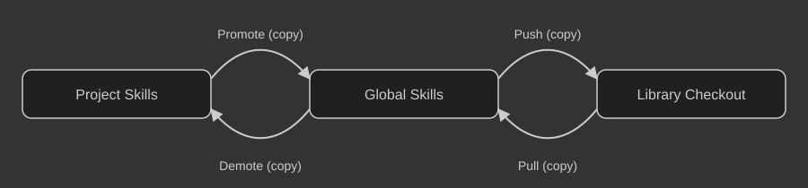

# AI Skills Library Commands

Use these commands to copy or move skills between this library checkout, global Codex skills, and a project's `.agents/skills` directory. Each location is an independent copy unless a move command removes its verified source.

## Table of Contents

1. [Getting Started](#getting-started)
2. [Details](#details)

## Getting Started

Use these steps to install the library skills, copy updates, and choose a transfer direction.

### 1. Install Commands

**Prompt AI:**

```
Install skills from https://github.com/SamuelAsherRivello/ai-skills-library into my global Codex skills as physical copies.
```

### 2. Update Commands

Over time the library may change with new features. Run:

**Prompt AI:**

```
$ai-skills-library-pull all
```

### 3. Choose a Library Command

Use the command list below to copy skills between the library, your global Codex skills, and a project. These commands do not fetch, commit, or push Git history.

## Details

<p align="center">
  
</p>

### Library Commands

| # | Name | Comment |
| --- | --- | --- |
| 1 | `$ai-skills-library-push <skill> or all` | Copies one named global skill or every valid global skill into this local library checkout. |
| 2 | `$ai-skills-library-pull <skill> or all` | Copies one named library skill or every valid library skill into global Codex skills. |
| 3 | `$ai-skills-library-move-global <skill> or all` | Moves one project skill or every valid project skill into global Codex skills. |
| 4 | `$ai-skills-library-move-project <skill> or all` | Moves one global skill or every valid global skill into the current project's `.agents/skills` directory. |
| 5 | `$ai-skills-library-status` | Lists every library skill and the differences in Codex user and project skills. |

Push, pull, and both move commands accept the literal `all`. Push and pull
preserve their source; move commands remove a source only after the destination
has been verified. All commands validate skills before copying, report changed,
skipped, and failed names separately, and stop before copying
when preflight finds a conflict. A matching destination is skipped. A different
destination is never replaced without your explicit authorization. Bulk
operations preflight the entire selection before writing.

Your global Codex skills directory is `C:\\Users\\<your-user>\\.agents\\skills`.
Installation uses physical copies, not junctions or symbolic links. Existing
links are not removed automatically; migrate them separately after verifying
your copied skills.

Commands stop for an existing destination skill instead of overwriting it without your explicit approval.
