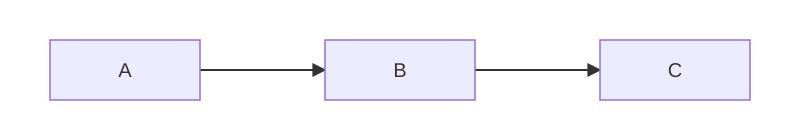
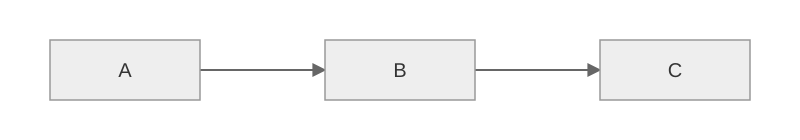
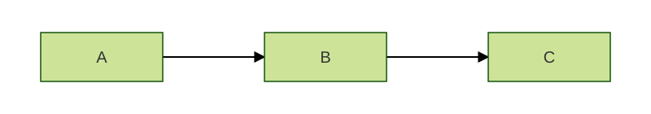
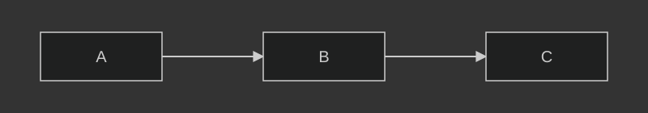
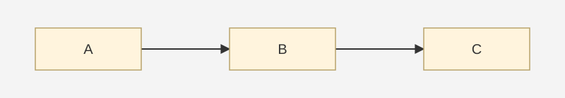

# Diagram Theme Comparisons

Compare the same **A → B → C** diagram in five Mermaid-inspired palettes. Each static SVG is centered and displayed at 800 pixels wide, without diagram controls.

These are palette comparison illustrations, not native Mermaid renderer output. Node colors follow the [official theme definitions](https://mermaid.js.org/config/theming); layout and some derived colors are simplified.

[Editable Mermaid source](theme-demo.mmd)

## Default

  

## Neutral

  

## Forest

  

## Dark

  

## Base

  

Base is the starting point for a custom palette. Choosing a palette here does not change the existing command diagrams.
