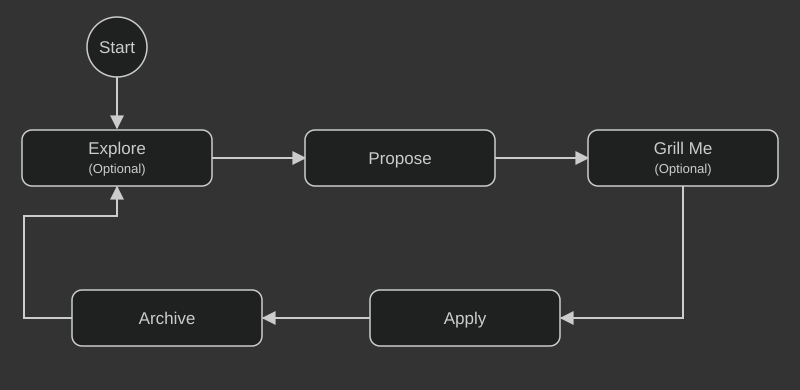

# OpenSpec Commands

Use OpenSpec to agree on a focused change before implementation, then keep its specifications aligned with the completed work.

## Table of Contents

1. [Getting Started](#getting-started)
2. [Details](#details)
3. [Command List](#command-list)
4. [Resources](#resources)

## Getting Started

Use this three-step workflow for one focused change.

### 1. Propose

**Prompt AI:**

```
$openspec-propose
```

Create the proposal, specifications, design, and tasks for the change.

### 2. Apply

**Prompt AI:**

```
$openspec-apply-change
```

Implement the approved change and complete its tasks.

### 3. Archive

**Prompt AI:**

```
$openspec-archive-change
```

Sync accepted delta specifications and archive the completed change.

## Details

Here are more commands to try.

## Command List

<p align="center">
  
</p>

Here are commands and the recommended AI intelligence level to use.

| # | Command | Purpose | Rec. Intelligence |
| --- | --- | --- | --- |
| 1 | `$openspec-explore` | Brainstorm a possible change without implementation. |  |
| 2 | `$openspec-propose` | Create one focused change proposal. |  |
| 3 | `$openspec-grill-me {n}` | Refine a proposal with `{n}` multiple-choice questions. |  |
| 4 | `$openspec-apply-change` | Implement the current change. |  |
| 5 | `$openspec-update-change` | Revise planning artifacts for an existing change. |  |
| 6 | `$openspec-sync-specs` | Apply accepted delta specifications to the main specifications. |  |
| 7 | `$openspec-archive-change` | Finalize and archive a completed change. |  |
| 8 | `$openspec-dashboard` | Open or inspect the local OpenSpec dashboard. |  |
| 9 | `$openspec-release-version` | Run a repository's checked-in version-release workflow. |  |

### Proposal Artifacts

With the default spec-driven schema, `$openspec-propose` creates these files inside
`openspec/changes/<change-name>/`. Other schemas may use different artifacts.

| File | Purpose | Answers? |
| --- | --- | --- |
| `proposal.md` | Defines the problem, goals, and scope. |  |
| `specs/<capability-path>/spec.md` | Defines requirements and scenarios. |  |
| `design.md` | Records the technical approach and key decisions. |  |
| `tasks.md` | Tracks implementation work. |  |

## Resources

- [OpenSpec documentation](https://openspec.dev/docs)
- [OpenSpec on GitHub](https://github.com/Fission-AI/OpenSpec)
