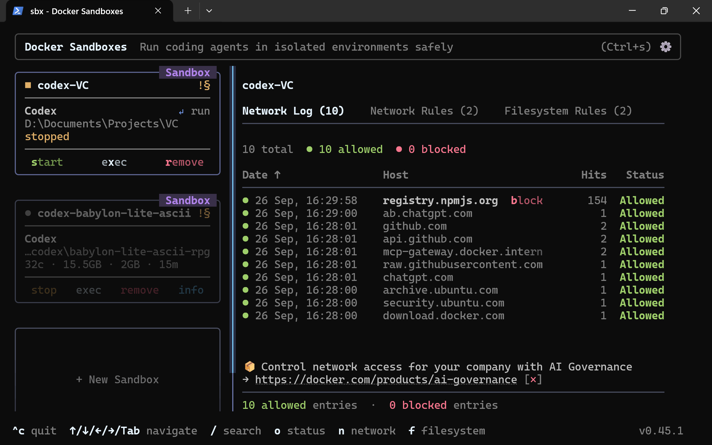

# Sandbox Setup

Set up Docker Sandboxes to run Codex in an isolated microVM while keeping your project folder available for review.

## Table of Contents

1. [Getting Started](#getting-started)
2. [Details](#details)
   1. [Setup](#1-setup)
   2. [Usage](#2-usage)
   3. [Test Your Results](#3-test-your-results)

## Getting Started

#### Video

[](https://www.youtube.com/watch?v=erQnRkMrpls)

#### Links

* [Docker Sandboxes installation guide](https://docs.docker.com/ai/sandboxes/install/)
* [OpenAI Codex page](https://openai.com/codex/).
* [Docker Sandboxes security defaults](https://docs.docker.com/ai/sandboxes/security/defaults/)
* [Docker Sandboxes local network policy](https://docs.docker.com/ai/sandboxes/security/policy/)
* [Docker Sandboxes Codex authentication](https://docs.docker.com/ai/sandboxes/agents/codex/)

## Details

### Overview

Docker Sandboxes runs Codex inside an isolated microVM with its own filesystem, Docker daemon, and network. The workspace you choose to share is mounted read-write; other host resources remain outside the sandbox.

### 1. Setup

Docker's current Windows instructions do not require Docker Desktop or WSL 2 to install or use `sbx`. The optional WSL and Docker Desktop steps below are useful when you also want Docker Desktop's WSL 2 workflow.

1. **Install WSL 2 (optional).** WSL 2 provides a Linux environment on Windows without managing a separate virtual machine.

   1. Open **PowerShell as Administrator**.
   2. Run:

      ```powershell
      wsl --install
      ```

   3. Restart Windows if prompted.
   4. Open a new PowerShell window and verify the installation:

      ```powershell
      wsl --version
      ```

   5. Finish the Linux-distribution setup if Windows prompts you to do so.

2. **Install Docker Desktop (optional).** [Docker Desktop](https://docs.docker.com/desktop/setup/install/windows-install/) is separate from Docker Sandboxes; install it only if you need Docker Desktop or its WSL 2 backend for other work.

3. **Enable local-sandbox virtualization.** Local Docker Sandboxes on Windows require Windows 11, a 64-bit Intel or AMD processor, and Windows Hypervisor Platform. In **PowerShell as Administrator**, run:

   ```powershell
   Enable-WindowsOptionalFeature -Online -FeatureName HypervisorPlatform -All
   ```

   Restart Windows if prompted.

4. **Install Docker Sandboxes.** In PowerShell, install the `sbx` command-line tool for your user:

   ```powershell
   winget install -h Docker.sbx
   ```

5. **Sign in to Docker.** Run the following command and complete the browser-based Docker sign-in:

   ```powershell
   sbx login
   ```

### 2. Usage

1. **Choose the project folder.** In a new PowerShell window, move to the repository or folder you want to share with the sandbox:

   ```powershell
   cd D:\path\to\your\project
   ```

2. **Prepare the target folder.** Install any npm dependencies you need on the host, in this project folder, before starting the sandbox. The workflow intentionally does not give the sandbox access to npm registries. Do not start `sbx` from a parent folder that contains other projects.

3. **Set the strict network default.** Choose deny-all so outbound network access starts blocked:

   ```powershell
   sbx policy init deny-all
   ```

   Do not add broad network rules. The Codex kit may provide the model/harness endpoints needed for Codex. After starting the sandbox, inspect its kit rules with `sbx policy ls project-locked --source kit --type network --wide` and verify they are needed for the selected model and harness. Do not allow npm registry domains. The start command adds explicit npm registry denies; deny rules take precedence over kit allows. When a destination is blocked, decline an access request unless you have verified that the selected Codex model/harness needs it.

   Check the effective global network rules with `sbx policy ls --type network --wide` and remove any old broad allow rules that this workflow does not need. The `deny-all` preset blocks destinations without an allow rule, but previously added allow rules can still apply.

4. **Provide Codex authentication through the host CLI.** Set up OpenAI OAuth on the host (or use the API-key prompt if your account uses an API key):

   ```powershell
   sbx secret set openai --oauth
   ```

   For API-key authentication, run `sbx secret set openai` and enter the key at its secure prompt. Do not put the key itself in the command arguments.

   This stores authentication with Docker Sandboxes on the host. The proxy supplies authenticated requests to the model service; the raw credential is not placed in the project, an environment variable, or the sandbox filesystem. Do not paste a raw API key into a command, project file, or prompt.

5. **Start a sandbox with only the target folder mounted.** From that folder, run:

   ```powershell
   sbx run --name project-locked --skills=off --deny-network npmjs.org --deny-network "*.npmjs.org" codex .
   ```

   `.` mounts only the current folder and its descendants. Docker Sandboxes does not expose other host folders unless you explicitly mount them. `--skills=off` also disables the separate shared skills mount. The sandbox's own VM filesystem remains available to its processes; this restriction concerns host folders. Local filesystem policy controls are not configured with the `sbx policy` CLI; if organization governance is available, set its filesystem read/write allow rules to this target path. Review the effective policy before relying on the boundary:

   ```powershell
   sbx policy ls project-locked --wide
   ```

6. **Work in the sandbox.** Codex can edit the mounted target folder. Any npm dependencies must already be present in that folder (for example, its local `node_modules`) before launch. Do not approve new network destinations unless they are required by the selected Codex model/harness and you have checked what they are.

### 3. Test Your Results

Run each check from the Codex prompt inside the sandbox:

1. **Test File Access** — `Try to read a file from a host folder outside the mounted target folder (for example, a sibling folder), then create test.txt in the current folder. Report whether the outside read was blocked and whether the in-folder write succeeded. Do not copy or print outside file contents.`
2. **Test Network Access** — `Check that the selected Codex model/harness can still make a request, then try to reach https://registry.npmjs.org. Report whether the model request works and the npm registry request is blocked.`
3. **Test Secrets Access** — `Check whether an OpenAI API key or OAuth token is readable from environment variables, project files, or ~/.codex/auth.json. Report only whether a raw credential is accessible; never print, copy, or transmit any credential value. The expected result is that no raw credential is readable in the sandbox.`

4. Open the Docker Sandboxes dashboard to inspect sandbox status, network activity, and filesystem rules:

   ```powershell
   sbx tui
   ```

   <a href="images/sandbox-tui.png">
     
   </a>

   Select the image to open the full-size dashboard screenshot.

You are now done.

Enjoy!
